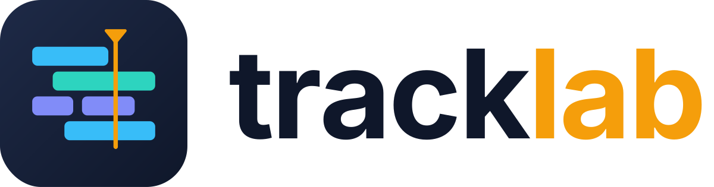

<p align="center">
  <picture>
    <source media="(prefers-color-scheme: dark)" srcset="assets/branding/png/tracklab-logo-dark.png">
    
  </picture>
</p>

# Tracklab

**Tracklab ist eine Digital Audio Workstation (DAW) mit eingebautem KI-Assistenten Claude** – für
**Windows 10/11** und **Linux (Linux Mint / Ubuntu)**. Aufnehmen, schneiden, mischen, mastern und exportieren
in einer Anwendung; Claude kann dabei jede Aktion direkt in Tracklab ausführen. Ohne Claude bleibt Tracklab voll
nutzbar.

> **Status:** frühe Entwicklung (Pre-Alpha). Es gibt noch keine nutzbare Anwendung – siehe [Stand](#stand).

## Was Tracklab können soll

Tracklab soll eine eigenständige DAW werden, die nach und nach alles kann, was die großen DAWs können. Was es so
sonst nicht gibt: Claude ist eingebaut, jede Aktion lässt sich auch per Claude oder von außen per MCP auslösen
(mit Rückgängig und Bestätigung); Konzertmitschnitte werden fast automatisch in fertige Songs zerlegt; Tracklab ist
Open Source und läuft vollwertig unter Windows und Linux; eigene Effekte sind dabei.

**Aufnehmen**
- Mehrspuraufnahme mit 12 und mehr Eingängen gleichzeitig, Latenzausgleich, Aufnahme in Lanes für mehrere Takes.
- Audio-Treiber: ASIO und WASAPI unter Windows, JACK/PipeWire und ALSA unter Linux.

**Schneiden und Editieren**
- Bereichsauswahl über mehrere Spuren, Ripple-Editing, Fades und Crossfades, Clip-Gain.
- Comping: aus mehreren Takes per Wischen die beste Version zusammenstellen.
- Marker und Regionen, z. B. einen Konzertmitschnitt an den Pausen erkennen und per Setlist in benannte Songs teilen.

**Mischen und Mastern**
- Freies Routing, Busse, Gruppen und VCAs, Automation, eigene Kopfhörermixe (Cue-Mixe) für die Band.
- Mid/Side-Bearbeitung für Master und Busse.
- VST3-Plugins (CLAP und LV2 später), Plugins abgeschottet, damit ein Absturz nicht die DAW mitreißt.
- Lautheitsmessung nach EBU R128 (LUFS, True Peak) und Normalisierung beim Export, z. B. auf −14 LUFS / −1 dBTP.

**Exportieren**
- WAV (z. B. 48 kHz / 24 Bit für Videoschnitt) und MP3, pro Song oder Region, mit Dateinamen-Platzhaltern und
  BWF-Zeitstempel, damit DaVinci Resolve die Songs an der Originalposition anlegt.
- Stems und Bounce-in-Place.

**Bedienung**
- Jede Aktion gleichwertig per Maus, Tastatur, MIDI-Controller, Claude-Panel, MCP und Kommandozeile.
- Fernbedienung per Handy oder Tablet im lokalen Netz (Transport, Aufnahme, Marker, Cue-Mix).
- Frei belegbare Tastenkürzel, dunkles und helles Theme, Hochkontrast-Theme.
- Automatisches Speichern und Backups; ein Projekt ist eine Datei (`.tracklab`) plus Audioordner.

## Claude in Tracklab

- **Claude-Panel in der Anwendung:** Aufgaben in Alltagssprache, z. B. „Teile den Mitschnitt nach dieser Setlist,
  setze Fades und exportiere jeden Song normalisiert als WAV und MP3“.
- **Lokaler MCP-Server (`tracklab-mcp`):** Claude Desktop, Claude Code und andere MCP-Clients steuern Tracklab
  von außen.
- **Kommandozeile (`tracklab-cli`):** dieselben Befehle für Skripte und Automatisierung, auch ohne Bildschirm.
- **Sicher by Design:**
  - Alle Wege nutzen dieselbe Befehlsliste mit geprüften Parametern (JSON-Schema), es gibt keinen zweiten Codepfad.
  - Jeder Claude-Auftrag ist ein einziger Undo-Schritt.
  - Destruktive Aktionen brauchen immer eine Bestätigung.
  - Claude bekommt keine Shell und hat nur Zugriff auf Projektordner und freigegebene Ordner.

## Stand

Meilenstein **M1 (Fundament)** läuft.

- **Engine-Spike erfolgreich:** JUCE 9.0.3 und Tracktion Engine laufen zusammen. Import, Rendern mit
  Lautheitsmessung, 12-Kanal-Aufnahme und VST3 funktionieren unter Linux und Windows.
- **Engine-Aufbau fertig:** Tracklab startet die Audio-Engine ohne Fenster und ohne Audiogerät, z. B. für Tests
  und die Kommandozeile.
- **Befehlsliste fertig:** Alle Aktionen sind registrierte Befehle mit Schema-Prüfung und verständlichen
  Fehlermeldungen. Die Liste ist in [`docs/commands.md`](docs/commands.md) dokumentiert.
- **Undo/Redo fertig:** Jeder Befehl und jedes Befehlspaket ist genau ein Undo-Schritt; scheitert ein Befehl, wird
  er vollständig zurückgenommen, ohne die bisherige Undo-Historie zu verlieren.
- **Audio-Geräte fertig:** Treiber und Gerät wählen (ALSA, JACK/PipeWire unter Linux; WASAPI, ASIO unter Windows),
  Samplerate, Puffer und Kanäle; die Wahl bleibt über Neustarts erhalten. Handtest an echter Hardware steht noch aus.
- **Als Nächstes:** Projektformat, automatisches Speichern, Kommandozeile und das erste Programmfenster.

Arbeitsstand im Detail: [`team/RESUME.md`](team/RESUME.md) · Plan: [`team/plan/PLAN.md`](team/plan/PLAN.md).

## Technik

- C++20, CMake, Ninja.
- [JUCE](https://juce.com) 9.0.3 und [Tracktion Engine](https://github.com/Tracktion/tracktion_engine) als
  Submodule unter `third_party/`.
- **Echtzeit-Regeln im Audio-Thread:** keine Allokation, keine Locks, kein IO. Geprüft mit dem RealtimeSanitizer
  von Clang ([`docs/realtime.md`](docs/realtime.md)).
- Entscheidung und Begründung: [ADR-001](docs/adr/ADR-001-tech-stack.md).

## Selbst bauen

```bash
git clone https://github.com/brummilab/Tracklab-DAW.git
cd Tracklab-DAW
git submodule update --init          # nicht rekursiv
cmake --preset linux-gcc-debug       # Windows: windows-msvc-debug
cmake --build --preset linux-gcc-debug
```

- Linux-Pakete: `team/research/engine-spike/NOTIZEN.md` §8.
- Windows: Visual Studio 2022 mit „Desktopentwicklung mit C++“.
- Prüfungen (Format, Build, Tests, Echtzeit): `./scripts/gate.sh all` bzw. `scripts\gate.ps1`.

**Test-Builds:** Jeder Code-Push auf `main` erzeugt Builds als Download in den GitHub-Actions-Läufen (Workflow `gate`).

## Repo-Struktur

| Pfad | Inhalt |
|---|---|
| `src/`, `tests/` | Tracklab-Code (Module `core`, `engine`, später `project`, `io`, `cli`, `app`) und Tests |
| `third_party/` | JUCE, Tracktion Engine, JSON-Bibliotheken (Submodule, Fremdcode) |
| `spike/engine/` | Engine-Spike als Referenz |
| `assets/branding/` | Logo, App-Icon, Farben |
| `docs/` | Befehlsreferenz, Echtzeit-Regeln, Architekturentscheidungen, Auftrag |
| `team/` | Entwicklungsprozess: Stand, Entscheidungen, Design, Plan, Board, Recherche, Reviews |
| `.claude/`, `CLAUDE.md` | Regeln und Agent-Definitionen für die Entwicklung mit Claude Code |
| `scripts/`, `.github/workflows/` | Gate (lokale Prüfungen) und CI |

## Entwicklung

Tracklab wird mit Claude Code entwickelt:
- Ein Team Lead plant und prüft.
- Spezialisierte Sub-Agents schreiben die Tests, setzen sie um und reviewen das Ergebnis.
- Jede Änderung muss das Gate bestehen.

Regeln: [`CLAUDE.md`](CLAUDE.md) · Prozess: [`team/README.md`](team/README.md).

## Lizenz

GNU Affero General Public License v3.0 (`AGPL-3.0-only`, siehe [`LICENSE`](LICENSE)). Die Lizenz folgt aus JUCE
(AGPLv3) und Tracktion Engine (GPLv3). Wer einen Build erhält, bekommt auch den Quelltext.
